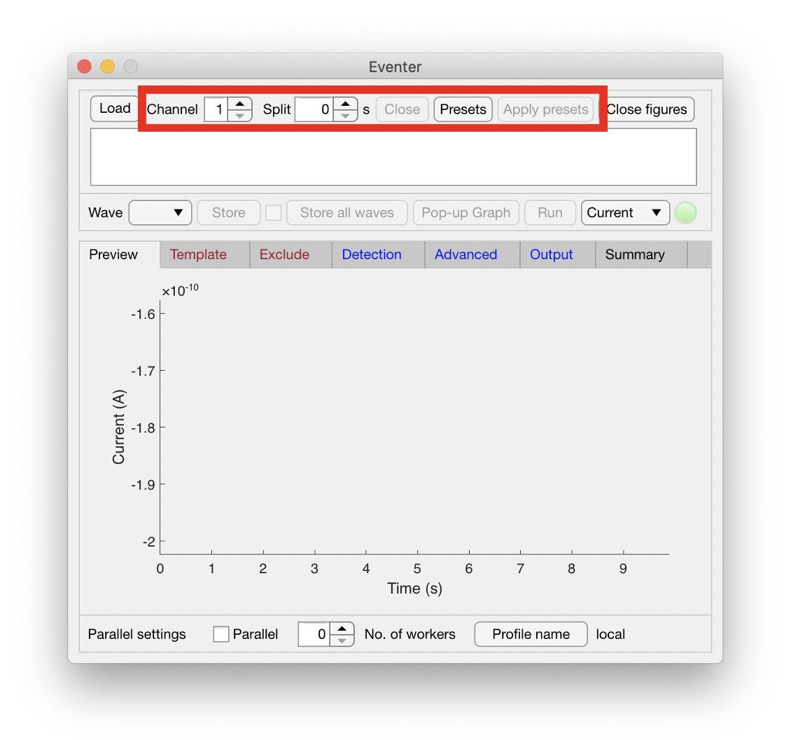
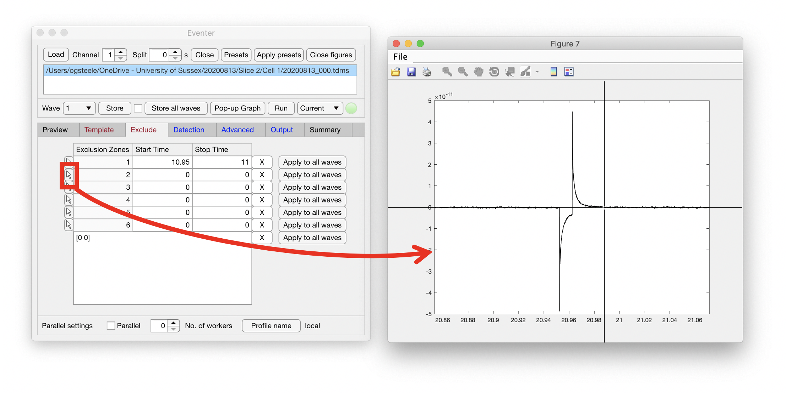
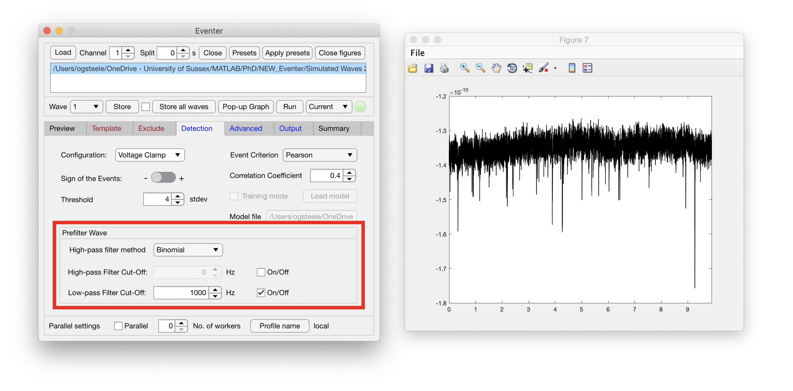
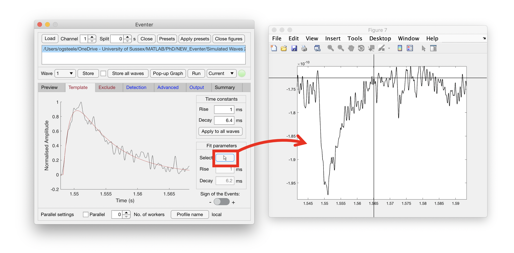
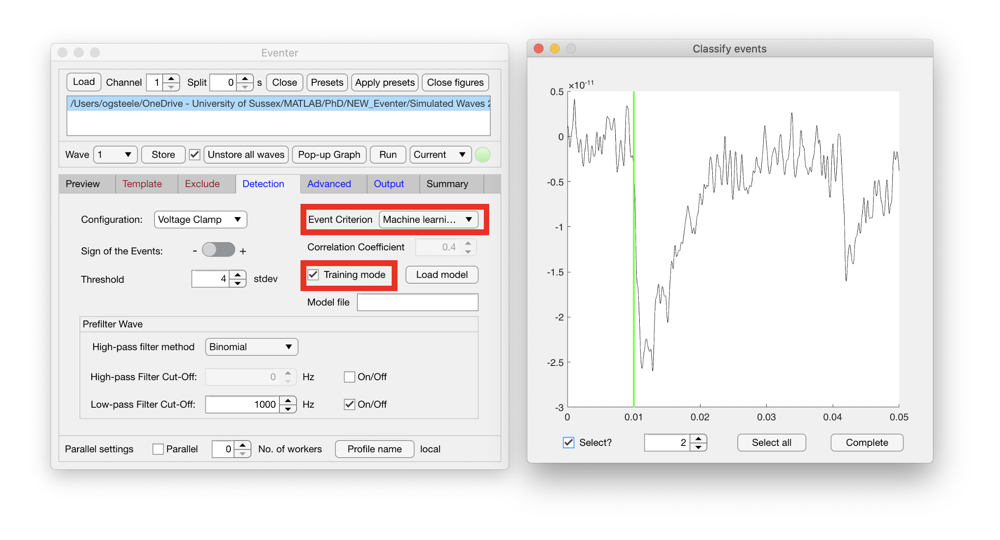

```{r setup, include=FALSE}
library(learnr)
# emo::ji is a little funny with this latest version, so install dev version from github
# install.packages("devtools")
# devtools::install_github("hadley/emo")
library(emo)
knitr::opts_chunk$set(echo = FALSE)
```

## Introduction  

<font size = "3">  

Welcome to the slice physiology session! In this session you'll see acute brain slices being prepared before getting hands-on with analysing data extracted from these acute brain slices using Eventer and Stimfit. Work through the below tabs in order and don't hesitate to ask questions at any point! 

Throughout this worksheet you'll notice several symbols, make sure to pay attention to these as these will help guide you through the session. The below table should hopefully explain what these mean.

| Symbol | Meaning | What should i do when seeing this? |  
|:-----------------|:--------------------|:--------------------|  
| `r emo::ji("thinking")` | Question |  Please answer and be prepared to feed back to the tutors through the session |  
| `r emo::ji("exclamation")` | Task | Best to follow these instructions ... |  
| `r emo::ji("angel")` | Tip | These little people are just here to help, they may make your life a bit easier! |  

Please enjoy the session, and make the most of it by asking any questions you have - we're happy to help.  

<font size="4">  

| `r emo::ji("thinking")` QUESTIONS FOR ANDY |
|:---------------------------|
| What do you think about html alerts?       |  
| |  

</font>  


Alerts like this ...   

<div class="alert alert-danger"> alert alert-danger </div>  
<div class="alert alert-warning"> alert alert-warning </div>  
<div class="alert alert-info"> alert alert-info </div>  

... in which the text can also be formatted to the left ...  
<div align="left">
<div class="alert alert-danger"> **WARNING** This video contains scenes you may find upsetting **WARNING** </div>  
</div>  
... center ...  
<center>
<div class="alert alert-warning"> **TIP** Don't watch if you don't want to </div>  
</center>  
... and right of the page.  
<div align="right">
<div class="alert alert-info"> **INFO** Something else relevant </div>  
</div>

## 1. Slicing

### Acute Brain Slicing Procedure

**Methodology**  

Write methodology in here later ...

**Video Protocol**  


<center>
**Figure 1** *Video of acute brain slicing*
</center>  


| `r emo::ji("thinking")` ACUTE SLICING QUESTIONS |
|:---------------------------|

```{r questions}
quiz(
  question("What is the benefit of the cutting solution being ice-cold?",
    answer("Strengthen the cell membranes of the neurons"),
    answer("Stop the brain overheating"),
    answer("Slow the activity of enzymes acting to damage the slice", correct = TRUE),
    answer("It looks ... cool ...")
  ),
  question("What is the ideal mix of Na & Mg in the slicing media?",
    answer("High Mg, High Na"),
    answer("Low Mg, Low Na"),
    answer("High Mg, Low Na", correct = TRUE),
    answer("Low Mg, High Na")
    #correct = "spot on, well done!",
    #incorrect = "not quite!"
  )
)
```

## 2. Recording

### Acute Brain Slicing Procedure

**Methodology**  

Write methodology in here later ...

**Video Protocol**  


<center>
**Figure 1** *Video of acute brain slicing*
</center>  


| `r emo::ji("thinking")` ACUTE SLICING QUESTIONS |
|:---------------------------|

```{r questions-2}
quiz(
  question("What is the benefit of the cutting solution being ice-cold?",
    answer("Strengthen the cell membranes of the neurons"),
    answer("Stop the brain overheating"),
    answer("Slow the activity of enzymes acting to damage the slice", correct = TRUE),
    answer("It looks ... cool ...")
  ),
  question("What is the ideal mix of Na & Mg in the slicing media?",
    answer("High Mg, High Na"),
    answer("Low Mg, Low Na"),
    answer("High Mg, Low Na", correct = TRUE),
    answer("Low Mg, High Na")
  )
)
```   

## 3. Eventer

<div align="justify">

In the section we will be analysing some of the data we generated during the experiment seen previously. Synaptic events are particularly small, and can frustratingly look quite similar to the background noise. For this reason we use a software, built in house, called Eventer that dramatically improves the speed and reproducibility of this analysis. Some quick experimental parameters that will help to understand the data you're analysing is shown below;  

* Acute brain slices from 3m old wild type mice
* Whole cell patch clamp in the CA1 stratum pyrimadale 
* Miniature excitatory post synaptic currents clamped at -65 mV
  * TTX, PTX & GCP present throughout (blocking NaV, GABAa & GABAb)
* Test pulse every 30 seconds

### Preload settings  
Choose your channel and split settings. Only some data formats allow for multiple recording channels, so unless you need to, the channel feature can be left at 1. Split should only be used if your data varies in length or if you want to split a continuous recording wave into smaller chunks for parallel processing.

<center>
{width=100%}  
  <br>
**Figure 1** *Pre-load settings in Eventer*
</center>

<br>
<br>

<font size="4">  

| `r emo::ji("angel")` TIP |
|:---------------------------|
| **Need to change the split length?** <br> *To do so, the file must be closed, the split length changed, and then the file loaded again*  |  
| |  


</font>  

### Loading your data  
Choose which data you wish to analyse. Multiple data sets can be analysed at once. Eventer will merge these data sets together so ensure you are loading data that you want merged. To load multiple data sets to be merged, simply repeat the loading process shown below.  

<center>
{width=100%}    
  <br>
**Figure 2** *Loading your data in Eventer*
</center>

<br>
<br>

<font size="4">  

| `r emo::ji("exclamation")` TASK|
|:---------------------------|
|**Please now load** `filepath\filename`|  
| | 

</font>

### Visualising your data
Eventer includes a preview tab for immediate visualisation of your data upon loading. To inspect the data in more detail, the ‘Pop-up Graph’ should be used as shown here. This graph can then be zoomed and dragged to located individual events.

<center>
{width=100%}  
  <br>
**Figure 3** *Visualising your data in Eventer*
</center>

<font size="4">  

| `r emo::ji("angel")` TIP |
|:---------------------------|
| *The synaptic events you are seeing are all excitatory, so by convention downwards at this holding potential, however the test pulse is still visible and very large. At this point, it's advisable to exclude these from your recordings. This can be done individually for every pulse you see, or you can split recording so that the event you're looking to exclude is at the beginning of each 'wave' at the same time. This will make it very easy to exclude them all with one click!* |  
| |  

| `r emo::ji("exclamation")` TASK |
|:---------------------------|
| Please now close your recording, changing the split interval to the duration of the test pulse interval, then reload the file <br> You should now see the test pulse at the beginning of each wave |  
| |  

</font>

### Excluding regions from your analysis
It is possible that there are regions of your data that you want to be excluded from the analysis. For example, this could be a particularly noisy section of recording or the inclusion of a test pulse as shown here. To exclude these regions, open the exclude tab and regions to be excluded can either be manually typed in or selected using the highlighted button. Selecting this button will bring up cursors similar to the template selection window.

<center>
{width=100%}  
**Figure 4** *Excluding regions from your analysis in Eventer*
</center>  

<font size="4">  

| `r emo::ji("exclamation")` TASK |
|:---------------------------|
| Exclude the test pulse from your current wave, and then apply this setting to all waves |  
| |  

</font>

### Prefiltering your data
It is possible that excess noise is still present in your data that may not have been isolated during data acquisition. To help visualise data, Eventer enables the user to pre-filter their data through high- and low-pass filter cut offs. Shown here, a 1 kHz low-pass filter is applied to the data in the detection tab.

<center>
{width=100%}  
**Figure 5** *Pre-filtering your data in Eventer*
</center>

<font size="4">  

| `r emo::ji("exclamation")` TASK |
|:---------------------------|
| Apply a 1 kHz low pass filter to your data |  
| |  

</font>

### Defining your event template
In the template tab you can set a template event for the software to compare your data against. This can be set manually if the rise and decay parameters of your events are known, or can be done through opening the ‘Pop-up Graph’ as mentioned before and selecting the button highlighted here. This will allow the user to select two points; one before and one after the event of interest. The time constants will then be in the boxes below the highlighted button and should then be copied into boxes above before selecting the button ‘Apply to all waves’.
It is worth locating an event in the ‘Pop-up Graph’ before defining the time constants and that the sign of your events is correctly stated in the detection panel.

<center>
{width=100%}  
**Figure 6** *Defining your event template in Eventer*
</center>

<font size="4">  

| `r emo::ji("exclamation")` TASK |
|:---------------------------|
| Define your event template carefully, then apply the `Rise` and `Decay` fit paremeters of your template to all waves |  
| |  

</font>


### Parallel Processing
If you wish to use parallel processing which will speed up analysis on newer computers, you can choose the number of workers. The limit of how many workers you can have is dependent on how many cores and threads your CPU has. After the worker number has been chosen, check the parallel box and wait for the workers to initialize.

<center>
{width=100%}  
**Figure 7** *Enabling parrellel processing in Eventer*
</center>

<font size="4">  

| `r emo::ji("angel")` TIP|
|:---------------------------|
| Don't worry too much about this for your recordings as they're not too long! |  
| |  

</font>

### Running your analysis
Once the user is happy with the settings for their analysis, open the output tab and ensure the data will be outputted into the desired output format and saved to the appropriate location. By default this will create a folder named ‘eventer.output’ in the current working directory that the data was located. Choose which waves you would like stored in the analysis by either going through each wave individually and selecting/deselecting the store checkbox, or click the store all waves button. Unless a new output folder is specified for new analysis on the same dataset, it will be overwritten when performing new analysis.
Changing the box on the right from ‘Current’ to ‘Batch’ will tell Eventer that the analysis can be performed on the batch of waves stored, rather than solely on the current wave. If the user has not loaded multiple files or split the recording then ‘Current’ and ‘Batch’ will both be the same. Having confirmed these settings the user can hit ‘Run’ and the light will turn green indicating analysis is in progress.

<center>
{width=100%}  
**Figure 8** *Running your analysis in Eventer*
</center>


<font size="4">  

| `r emo::ji("thinking")` QUESTION |
|:---------------------------|
| Should you be in **Batch** or **Current** mode? |  
| |  

| `r emo::ji("exclamation")` TASK |
|:---------------------------|
| Define your output folder as the name of your group and then run your analysis! |  
| |  

</font>


### Accessing your results
After running the analysis, Eventer will open multiple figures. A quick summary of results is also available in the summary tab as shown here. The rest of your results will be saved in the root directory in the previously specified output folder.

<center>
{width=100%}  
**Figure 9** *Accessing your results in Eventer*
</center>

### Training a machine learning model
Eventer also includes an option to enable users train a machine learning model against an exemplary set of data. To do this, open the detection tab and change the event criterion to ‘Machine Learning’ before ticking the ‘Training Mode’ tickbox. Running the analysis now will open up a window that will ask users to classify events as either events or not. A pop-up window will allow the user to also name their model. Move through the events selecting or deselecting events where appropriate until all events are classified then click complete.
When selecting whether an event is indeed actually an event, it is important that the green line shown above is exactly at the start of where you perceive the event to be otherwise the model may become inaccurate.

<center>
{width=850}   
**Figure 10** *Training a machine learning model in Eventer*
</center>


<font size="4">  

| `r emo::ji("exclamation")` TASK |
|:---------------------------|
| Classify events as either true events or false positives |  
| |  

</font>  

### Using your model
To then use the trained model on subsequent analysis, the user can then deselect the training mode and select load model in the detection tab. The trained model will be stored in the eventer output folder as a .mlm file as shown here. This model is now available for use on a new dataset, distinct from the set it was trained on. Upon completing your analysis with your machine learning model, you will be presenting with a plot showing the out-of-bag classification error which can briefly be described as a measure of the prediction error using bootstrap aggregating (bagging) to subsample data samples used for training. The prediction error should then stabilize well before reaching 128 trees (which is the default number of trees used by the implementation of Random Forests in Eventer).

<center>
{width=100%}   
**Figure 11** *Using your machine learning model in Eventer*
</center>


<font size="4">  

| `r emo::ji("exclamation")` TASK |
|:---------------------------|
| Please now load the model named `model`, stored at `filepath\model` and run your analysis using this model |  
| |  

</font>  


</div>

## 4. Stimfit

| `r emo::ji("exclamation")` TODO FOR OLI |
|:---------------------------|
| Format for Markdown     |  

Advanced Techniques in Neuroscience
Separation and analysis of AMPA and NMDA receptor-mediated synaptic conductances 
Visit the following webpage to familiarise yourself with Stimfit before starting:
https://neurodroid.github.io/stimfit/manual/getting_started.html

1.	Load the python electrophysiology software, Stimfit
2.	Import our lab python module by typing in the Python shell:
import penn
3.	Data was previously acquired by recording 10 evoked EPSCs at 6 different holding potentials (-100, -80, -60, -40, -20, 0 and +20 mV). Using the EPSCs acquired at -100 mV we will first demonstrate how to obtain an average EPSC. Load the raw data file by typing in the command shell:
penn.analysis.loadacq4()
Using the explorer in the file open dialog, navigate to:
Z:\techniques_in_neuro\C436R-2a\pair_001\dual_mixed_eEPSC_000\000
Select the raw data file Clamp2.ma and click open.
4.	The first trace is shown. Check the ‘Show selected’ box, press Ctrl + A, then right arrow to select the next trace and finally the F key to rescale the axes. This will reveal, select and show an overlay of the 10 EPSCs.
5.	Click the ‘Average’ button to average the EPSCs. 
 
6.	Close all the files by typing into the Python shell:
close_all()
7.	We have done the averaging procedure for recordings at all of the holding potentials and saved the average EPSCs for you. We will now load all the average EPSCs for a cell recorded at the different holding potentials,
convert the current recordings to conductance and separate the AMPA and NMDA conductances. Type into the Python shell:
penn.analysis.combiRec(0.01) 
Using the explorer in the file open dialog, navigate to:
Z:\ techniques_in_neuro\C436R-2a\pair_001\dual_mixed_eEPSC_000
Select the file ‘2’ and click open.
8.	Click the ‘Restore’ button
 
9.	Find the window with the recording of the ‘Mixed AMPA/NMDA-mediated conductance’ by selecting the window and typing in the command shell:
get_recording_comment()
Tip: To save you from repeatedly typing the same command, mouse click at the command prompt in the Python Shell and press Ctrl + up arrow to bring up the previous command etc.
10.	The EPSC shown is the average EPSC at -100 mV. Select this AMPA-EPSC by clicking the green tick button.
 
11.	 As before, now find the window with the recording of the 'NMDA-mediated conductance'
12.	Uncheck the Zero-base index box and select the last recording trace (7, average NMDA-EPSC at +20 mV) and select it by clicking the green tick button. 
        
13.	Now click Edit -> New window with… -> selected traces from all files
14.	Check the ‘Show selected’ box, press ctrl + A, then right arrow to select the next trace and finally the F key to rescale the axes.
15.	The leak conductance is the constant offset and this was different at -100 mV and +20 mV so we need to subtract the baseline. To do this, press B and then left mouse click, hold and drag then release to select a period of baseline. Two vertical dashed green lines should appear to indicate the start and end times of the selected baseline period. Press the Return key to update measurements. (See figure below)
 
16.	Now click Extensions -> subtract_base, check the ‘Show selected’ box then press ctrl + A, then right arrow to select the next trace and finally the F key to rescale the axes. In what ways do the kinetics of the EPSCs appear to differ?
17.	Now let us measure the peak amplitudes of the AMPA and NMDA conductances. Press P and then left mouse click, hold and drag then release to select a period of flanking the peak in both traces. Two vertical dashed red lines should appear to indicate the start and end times of the selected peak measurement period. Press the Return key to update measurements. Visually inspect the result to confirm that the horizontal dashed red line is level with the peak of the EPSC in the active trace (black). (See figure below)
          
18.	Select each trace noting down the following three measurements. Peak (from base), RT (Lo-Hi%) and T50. These correspond to the peak amplitude, the 20-80% rise time and the full-width half-maximum of the EPSC.
19.	The amplitude and kinetics are clearly different for AMPA and NMDA conductances. Let us look specifically at the kinetics by scaling the AMPA-EPSC to match the peak amplitude of the NMDA-EPSC. To do this click Extensions -> peakscale, check the ‘Show selected’ box then press ctrl + A, then right arrow to select the next trace and finally the F key to rescale the axes. (See figure below)
 
20.	Let us now quantify the decay rate of the different conductances. Select trace 1 (the AMPA-EPSC), uncheck the ‘Show 2 selected’ box, press D and then left mouse click, hold and drag then release to select the region soon after the peak of the EPSC until the EPSC has decayed. Two vertical dashed grey lines should appear to indicate the start and end times of the selected period for curve fitting. (See figure below)
 
21.	To carry out the fit, click Extensions -> biexpfit. Copy and paste the ‘Analysis results’ into notepad or an Excel spreadsheet. 
22.	Let us examine the fit and confirm we are satisfied with it. Check the ‘Show selected’ box, press ctrl + A then right arrow repeatedly to scroll through the fit traces. Confirm that we have a measurement in the table for ‘Weighted tau’. If not then ask your demonstrator. 
23.	Click the ‘Close’ window button (next to the ‘Restore’ button). Repeat steps 20-22 for the NMDA-EPSC (trace 2)
24.	Repeat steps 7-23 for two more cell recordings:
Z:\ techniques_in_neuro\C436R-2a\pair_002\dual_mixed_eEPSC_000\2
Z:\ techniques_in_neuro\C436R-2a\pair_003\dual_mixed_eEPSC_000\2
25.	Collect the data into a spreadsheet and present bar graphs for the:
1)	Ratio of peak AMPA/NMDA conductances 
2)	20-80% rise times of the conductances
3)	Weighted tau (time constant) of AMPA- and NMDA-EPSC decay 
Compare the properties above between AMPA- and NMDA-EPSCs using statistical tests.
How are the EPSC components differ? How are the unique properties important for the role AMPA and NMDA receptors play in synaptic transmission?

